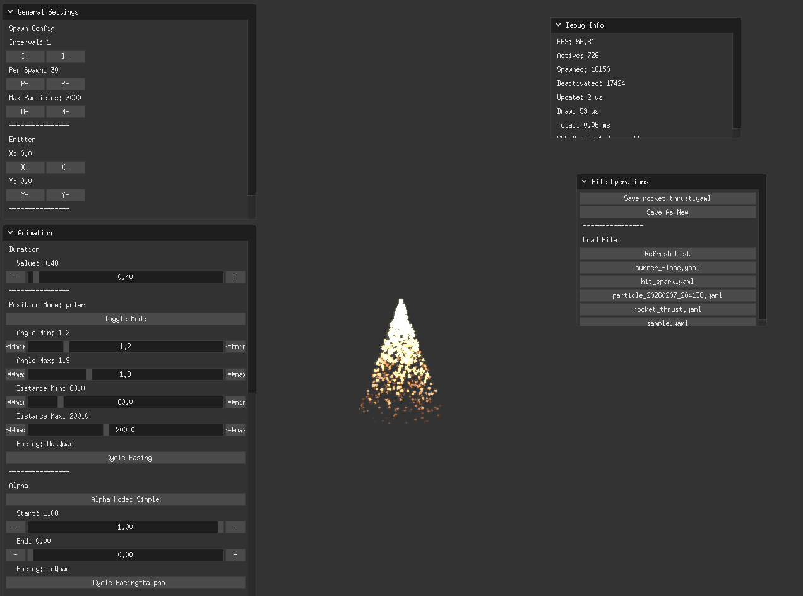

# chirashi

[](https://github.com/mogeta/chirashi/actions/workflows/ci.yml)
[](https://pkg.go.dev/github.com/mogeta/chirashi)
[](https://goreportcard.com/report/github.com/mogeta/chirashi)
[](LICENSE)
[](https://github.com/mogeta/chirashi/releases)

[日本語はこちら](README_JP.md)

`chirashi` is a GPU-oriented particle library and editor for Ebitengine.
It uses [donburi](https://github.com/yohamta/donburi) as the ECS library.


## Demo

You can try it in your browser:
[https://muzigen.net/ebiten/chirashi/](https://muzigen.net/ebiten/chirashi/)

## Features

- GPU batch rendering with `DrawTrianglesShader`
- Pool-based particle lifecycle with compact active/free index management
- Built-in editor for real-time parameter tuning and YAML save/load
- Position modes: `cartesian`, `polar`, `attractor`
- Emitter shapes: `point`, `circle`, `box`, `line`
- Optional vector emitters for one-shot rect fill/surface placement
- Optional emitter or per-particle ribbon trails with width/alpha/color gradients
- Property animation with easing and multi-step sequences
- Runtime attractor target updates for UI/item-collection effects
- Save/load particle configs as YAML
- donburi (ECS) integration

## Status

`chirashi` is usable as a game particle library today, but it is still in `v0.x`.
Expect iterative improvements to config validation, editor UX, and public API polish.

## Requirements

- Go 1.24+
- A platform supported by Ebitengine (desktop or web build target)

## Library Quick Start

```go
import (
    "github.com/mogeta/chirashi"
    "github.com/hajimehoshi/ebiten/v2"
    "github.com/yohamta/donburi"
    "github.com/yohamta/donburi/ecs"
)

world := donburi.NewWorld()
gameECS := ecs.NewECS(world)

particleSystem := chirashi.NewSystem()
gameECS.AddSystem(particleSystem.Update)
gameECS.AddRenderer(0, particleSystem.Draw)

shader, _ := ebiten.NewShader([]byte("..."))
image := ebiten.NewImage(8, 8)

manager := chirashi.NewParticleManager(shader, image)
_ = manager.Preload("sample", "assets/particles/sample.yaml")
_, _ = manager.SpawnLoop(world, "sample", 640, 480)
```

Runnable examples:

```bash
go run ./examples/minimal
go run ./examples/oneshot
```

Web example build:

```bash
GOOS=js GOARCH=wasm go build -o build/web/examples_web.wasm ./examples/web
```

## Config Format (YAML)

Particle effects are defined in YAML (see `assets/particles/*.yaml`):
Full schema and compatibility policy: `docs/CONFIG_SCHEMA.md`.

```yaml
name: "sample"
description: "sample particle"

emitter:
  x: 0
  y: 0
  space: "local"
  shape:
    type: "circle"
    radius: { min: 0, max: 48 }
    start_angle: 0
    end_angle: 6.2831855
  vector:
    type: "rect"
    placement: "surface"
    rect:
      width: 180
      height: 96

animation:
  duration:
    value: 1.0
  position:
    type: "polar"
    angle: { min: 0.0, max: 6.28 }
    distance: { min: 50, max: 150 }
    easing: "OutCirc"
  alpha:
    start: 1.0
    end: 0.0
    easing: "Linear"
  scale:
    start: 1.0
    end: 0.5
    easing: "OutQuad"
  rotation:
    start: 0.0
    end: 3.14
    easing: "Linear"

trail:
  enabled: true
  mode: "particle"
  space: "world"
  max_points: 12
  min_point_distance: 6
  max_point_age: 0.35
  width: { start: 18, end: 0, easing: "OutQuad" }
  alpha: { start: 0.8, end: 0.0, easing: "Linear" }
  color:
    start_r: 0.6
    start_g: 0.9
    start_b: 1.0
    end_r: 0.1
    end_g: 0.2
    end_b: 0.8
    easing: "OutQuad"

spawn:
  interval: 1
  particles_per_spawn: 10
  max_particles: 1000
  is_loop: true
```

Config highlights:

- `emitter.shape` controls where particles are spawned around the emitter origin.
- `emitter.vector` can distribute one-shot particles across a rectangle fill/outline or along a linear/quadratic polyline path.
- `emitter.space: world` lets emitted particles keep their world position when the emitter moves later.
- `animation.position.type: attractor` curves particles toward a runtime target.
- `animation.position.flow` adds low-cost curl flow on top of the base path for drifting smoke, space dust, and magic ambience.
- `trail` adds optional `emitter` or `particle` ribbon trails in world or local space.
- `PropertyConfig` supports both simple `start/end/easing` and multi-step `sequence` mode.
- Example effects are available under `assets/particles/`.

Notable samples:

- `sample.yaml`: basic radial burst
- `collect_coins.yaml`: attractor-based pickup flow into UI
- `rune_ring.yaml`: circular ring emission
- `fountain_arc.yaml`: arc-shaped directional spray
- `muzzle_flash_cone.yaml`: short forward cone burst
- `barrier_edge.yaml`: perimeter emission around a box
- `starlit_drift.yaml`: curl-flow ambient starfield drift around the emitter
- `vector_box_shatter.yaml`: rectangle outline burst for panel shatter and UI breakup
- `digit_five_bubble_burst.yaml`: number-shaped burst sampled from a polyline "5"

## Runtime Notes

- The library is optimized around spawn-time randomization and batched draw submission.
- Shape sampling happens when particles spawn; it does not add per-frame draw cost.
- `animation.position.flow` adds update-time CPU cost proportional to active particles and `octaves`; keep `octaves` low for mobile targets.
- `trail.mode: emitter` adds CPU cost proportional to `trail.max_points`.
- `trail.mode: particle` adds CPU and memory cost proportional to `active_particles * trail.max_points`.
- `trail.mode: particle` keeps detached tail ghosts alive until `trail.max_point_age` expires.
- `ParticleManager.SpawnLoop` returns an entity so the effect can be removed manually later.
- `SetAttractor` can be called each frame for moving attractor targets.
- `SetEmitterPosition` can be called each frame for moving emitters and ribbon trails.

## Public API

Primary import path:

```go
import "github.com/mogeta/chirashi"
```

See `docs/PUBLIC_API.md` for the intended stable surface during `v0.x`.

## Editor

The editor is included as a tuning tool and sample app for authoring YAML configs.

Run the editor directly:

```bash
go run ./cmd/chirashi-editor
```

Or use Mage tasks:

```bash
mage run
```

Available tasks:

```bash
mage -l
```

Key build commands:

```bash
mage build         # Build native binary to build/
mage buildRelease  # Optimized build
mage buildWeb      # Build WASM files into build/web
mage serve         # Build web assets and serve on localhost:8080
mage test          # Run go test ./...
```

## Examples

- `examples/minimal`: looped particle effect
- `examples/oneshot`: one-shot spawning on input
- `examples/web`: WASM/browser example

## License

MIT License

## Release Notes

- Changelog: `CHANGELOG.md`
- Release process: `docs/RELEASE_PROCESS.md`
- Migration notes: `docs/MIGRATIONS.md`
